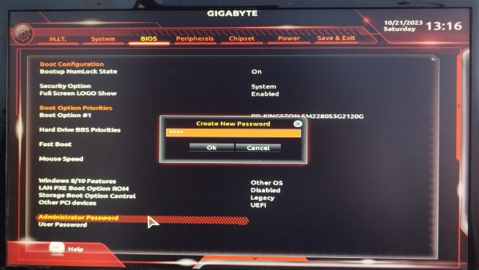
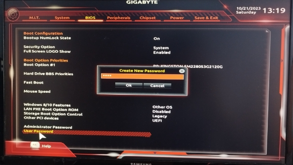
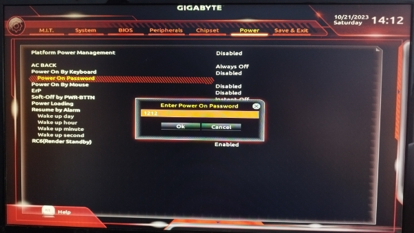
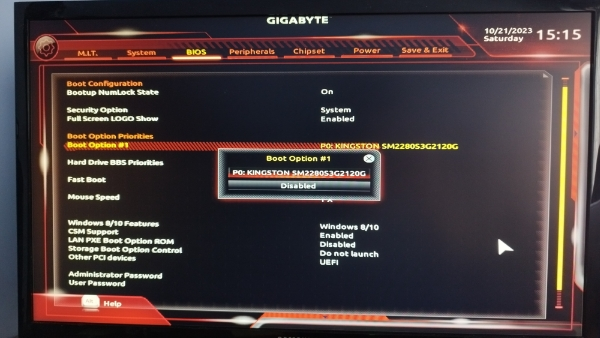

**Proyecto 1: Protección de la BIOS/UEFI**
##
Para asegurar la máxima protección en un sistema Windows, es esencial comenzar con una configuración de BIOS adecuada. Para ello, será necesario la activación y ajuste de varios parámetros clave que fortifican la seguridad del proceso de arranque. A continuación, se presenta una guía explicada paso a paso donde se realizarán todas las configuraciones pertinentes para garantizar la máxima protección posible en un sistema Windows, para ello realizaremos todas estas configuración en la BIOS/UEFI de nuestro equipo.

1. ### **Contraseña de Administración de la BIOS**

Una de las configuraciones más importantes para garantizar la seguridad del sistema es establecer una contraseña de administrador para la BIOS. Esta contraseña será requerida para cuando se necesite modificar algún parámetro de la BIOS. Realizar esta configuración permite aumentar la seguridad del sistema, evitando que cualquier usuario que no tenga los permisos de administrador pueda realizar algún                                 cambio en la configuración de la BIOS.

Para activar este parámetro en las BIOS, primeramente, debemos acceder a la BIOS, iremos al apartado de seguridad en la BIOS y encontraremos la contraseña de administrador y de usuario, la cual explicaremos en el siguiente paso, seleccionaremos a la contraseña de administrador y estableceremos la contraseña.

2. ### **Contraseña de usuario de la BIOS**
Como hemos comentado anteriormente otro parámetro de la configuración importante para la seguridad es la contraseña de usuario de la BIOS, esta contraseña se solicitará al acceder a los parámetros básicos de la BIOS. A diferencia de la contraseña de administrador, es que la contraseña de usuario proporciona un nivel de acceso con ciertas limitaciones, no podremos modificar todos los parámetros de la BIOS, principalmente los más complejos, pero aun así ofrece una capa extra de seguridad. Ambas contraseñas son necesarias para realizar un control estricto sobre el sistema, y su implementación conjunta puede fortalecer significativamente la seguridad del sistema.

Este parámetro al igual que el anterior se configura de igual manera.

3. ### **Contraseña de Arranque del Dispositivo**
Otro aspecto crucial es configurar una contraseña de arranque del dispositivo. Esta contraseña se solicitará al intentar arrancar el equipo. Al activar esta opción, se deniega que el sistema arranque sin la contraseña establecida. Esto proporciona una protección adicional contra intentos no autorizados en el sistema.

Para configurar este parámetro, ya una vez dentro de la BIOS, la podemos encontrar ubicada en la misma sección de contraseñas o en una sección separada relacionada con el arranque, este tipo de parámetro viene denominado por “Power On Password”.

4. ### **Permiso para el arranque desde dispositivos USB**
El cuarto paso implica la denegación del permiso para el arranque mediante dispositivos USB. Al desactivar el arranque desde dispositivos USB, se previene la posibilidad de iniciar el sistema desde medios extraíbles no autorizados, lo que evita posibles amenazas de malware.

En mi caso, mi BIOS no contempla la opción comentada anteriormente, por ello voy a explicar cuales son los pasos comunes en la mayoría de UEFI/BIOS para deshabilitar el permiso para el arranque desde dispositivos USB. A pesar de que esta es una función común en muchas BIOS, mi modelo específico no la incluye.

Normalmente, para poder llevar a cabo esta opción debemos acudir al apartado de la sección de arranque (boot), ahí encontraremos una opción que permite deshabilitar opciones de arranque no deseadas.

5. ### **Orden de arranque**

Configurar el orden de arranque es esencial ya que este define en el sistema cuales los diferentes dispositivos de almacenamiento que van a cargar un sistema, en este parámetro se establecen el orden en que el que el sistema va a leer los distintos dispositivos para cargar el sistema que contenga dicho dispositivo. Establecer un orden de arranque adecuado asegura que el sistema intente iniciar desde fuentes confiables antes de explorar otras opciones.

El orden de arranque funciona de la siguiente manera: cuando el ordenador es encendido, buscará un posible arranque en el primer dispositivo que se indique, si no lo encuentra, lo intentará en el segundo, y así sucesivamente.

Esta opción se configura en el apartado denominado “Boot option priotities”.

6. ### **Secure Boot**

Esta última seguridad es otra se las mas importante para proporcionar una capa adicional de seguridad al sistema.

Este parámetro deniega la ejecución de software no firmado durante el proceso de arranque, garantizando la integridad del sistema operativo. Esta característica es especialmente importante para proteger contra la carga de software malicioso durante el arranque.

Para desactivar este permiso deberemos acceder a la sección de configuración de arranque o en la sección de configuración de dispositivos, en mi caso encontramos esta opción en el apartado denominado BIOS, primero desactivaremos el CSM, para a continuación poder acceder a la seguridad de arranca denominada Secure Boot y habilitarla, con estos parámetros activados ya el arranque por USB está deshabilitado. 

Además de las opciones comentadas anteriormente, también podemos encontrar otras herramientas de seguridad para blindar aun mas un sistema Windows.

1\. **Configuración de TPM** (Trusted Platform Module): No todas las placas tienes esta función disponibles, ya que es una herramienta mas actual, El TPM es una opción habilitable la BIOS/UEFI, este  proporciona un entorno seguro donde almacenar claves de cifrado para proteger la información.

2\. **Configuración de Restricción de Modo de Arranque (Boot Mode Restriction):** Es una caracteristica que puede permitir o denegar que tipo de modo de arranque son permitidos o denegados en el sistema. Los dos modos principales y entre los que podremos ambiar son UEFI y Legacy BIOS.

3\. **Configuración de Restricción de Acceso a Puertos** en la BIOS/UEFI se puede controlar las restricciones de los puertos físicos de un ordenador. Dependiendo de cada modelo y marca de la BIOS permitirá mas o menos funcionabilidades, puertos USB, puertos Ethernet, entre otros puertos de entrada/salida.
